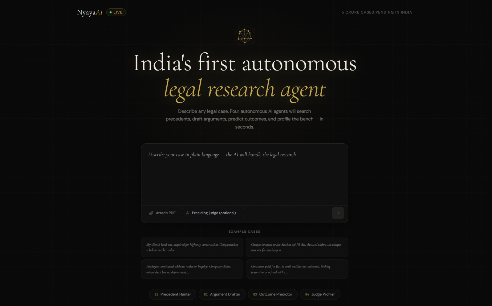

<div align="center">

# ⚖️ NyayaAI
### Autonomous Multi-Agent AI Legal Research Platform for the Indian Judiciary

<p align="center">
An AI-powered legal research assistant that analyzes legal cases, retrieves relevant precedents, drafts legal arguments, predicts possible outcomes, and provides judge-specific insights using a multi-agent RAG pipeline.
</p>
</div>

---

# Overview

NyayaAI is an AI-powered legal research platform designed to simplify legal analysis within the Indian judicial system.

Instead of providing generic AI responses, NyayaAI combines **Retrieval-Augmented Generation (RAG)** with a **multi-agent architecture** to generate evidence-backed legal insights from Indian court judgments.

The platform assists lawyers, law students, researchers, and legal professionals by automating time-consuming legal research while maintaining transparency through retrieved precedents.

---

# Key Features

### Intelligent Legal Research
- Semantic search over Indian court judgments
- Retrieves relevant precedents using vector similarity search
- Context-aware legal reasoning

### Multi-Agent AI Pipeline
Four specialized AI agents collaborate to solve legal problems:

### Agent 1 — Precedent Hunter
- Searches similar judgments
- Retrieves relevant legal precedents
- Uses semantic vector search

### Agent 2 — Argument Drafter
- Generates structured legal arguments
- Supports both plaintiff and defendant perspectives
- Uses retrieved precedents as context

### Agent 3 — Outcome Predictor
- Predicts possible judicial outcomes
- Estimates likelihood of success
- Provides legal reasoning

### Agent 4 — Judge Profiler
- Generates judge-specific insights
- Provides advocacy recommendations
- Suggests courtroom strategy

---

# System Architecture

```
                 User Case Description
                         │
                         ▼
               FastAPI Backend API
                         │
      ┌──────────────────────────────────┐
      │      LangGraph Agent Pipeline     │
      └──────────────────────────────────┘
             │
             ▼
 ┌──────────────────────────────────────────┐
 │ Agent 1 : Precedent Hunter               │
 │ • ChromaDB                              │
 │ • Semantic Search                       │
 └──────────────────────────────────────────┘
             │
             ▼
 ┌──────────────────────────────────────────┐
 │ Agent 2 : Argument Drafter               │
 │ • Gemini AI                             │
 │ • Legal Reasoning                       │
 └──────────────────────────────────────────┘
             │
             ▼
 ┌──────────────────────────────────────────┐
 │ Agent 3 : Outcome Predictor              │
 │ • Outcome Analysis                      │
 │ • Probability Estimation                │
 └──────────────────────────────────────────┘
             │
             ▼
 ┌──────────────────────────────────────────┐
 │ Agent 4 : Judge Profiler                 │
 │ • Judge Analysis                        │
 │ • Advocacy Suggestions                  │
 └──────────────────────────────────────────┘
             │
             ▼
          React Frontend
```

---

# Tech Stack

## Frontend

- React 18
- Vite
- Tailwind CSS
- React Router
- Axios

## Backend

- FastAPI
- Python
- Uvicorn

## AI

- Google Gemini
- LangGraph
- LangChain

## Retrieval

- ChromaDB
- Sentence Transformers
- Vector Embeddings

## Data Source

- Indian Kanoon API

---

# Installation

## Clone Repository

```bash
git clone https://github.com/KaushikDutta7/Nyay-AI.git

cd NyayaAI
```

---

## Backend Setup

```bash
cd backend

pip install -r requirements.txt
```

Create a `.env`

```env
GEMINI_API_KEY=YOUR_API_KEY

KANOON_TOKEN=YOUR_TOKEN
```

Populate the Vector Database

```bash
python ingest.py
```

Run Backend

```bash
uvicorn main:app --reload
```

Backend

```
http://localhost:8000
```

---

## Frontend Setup

```bash
cd frontend

npm install

npm run dev
```

Frontend

```
http://localhost:5173
```

---

# Project Structure

```
NyayaAI/

│
├── backend/
│   ├── main.py
│   ├── agents.py
│   ├── ingest.py
│   ├── vectorstore.py
│   ├── requirements.txt
│
├── frontend/
│   ├── src/
│   ├── public/
│   ├── package.json
│
├── README.md
│
└── .gitignore
```

---

# Workflow

1. User submits a legal case.
2. Case is sent to FastAPI.
3. ChromaDB retrieves similar judgments.
4. Gemini generates legal arguments.
5. Outcome predictor evaluates success probability.
6. Judge profiler provides advocacy insights.
7. Final report is displayed in the React frontend.

---

# Use Cases

- Legal Research
- Case Preparation
- Law Students
- Judicial Analytics
- Legal Education
- AI-assisted Litigation Support

---

# Future Improvements

- PDF judgment upload
- Citation verification
- Legal timeline generation
- Multi-language support
- Voice-based legal assistant
- Court document summarization
- Live Indian Kanoon integration
- Case comparison dashboard

---
